# Solution Architecture — BP Internet Banking

**C4 Design · Internet Banking System**

> Document following the C4 model (Context → Container → Component) with architectural justifications per exercise requirements.

---

## 1. Executive Summary

BP requires an internet banking system for account viewing, own and interbank transfers, and real-time notifications. The proposed solution is a **microservices architecture on AWS** with two front-end channels (SPA + Mobile App), OAuth 2.0 + PKCE authentication, biometric onboarding, a centralized integration layer, append-only audit logging, and multi-region high availability.

---

## 2. Context Diagram (C4 — Level 1)

> For non-technical audiences. Shows BP Internet Banking and its relationships with users and external systems.

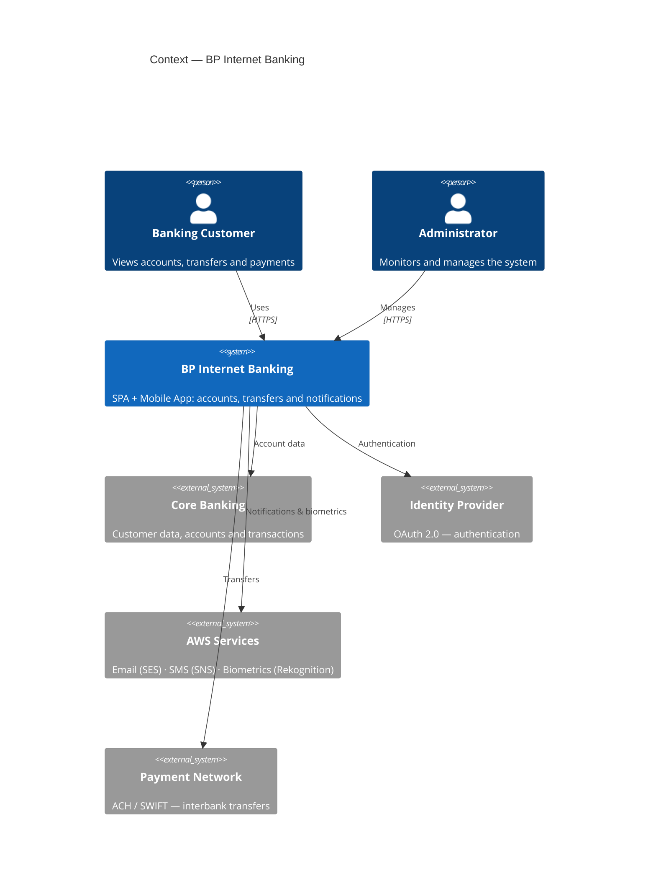

### Actors and External Systems

| Actor / System | Type | Role |
|---|---|---|
| Banking Customer | Person | Retail user — accounts, history, transfers |
| Operations Administrator | Person | Internal staff — monitoring and alerts |
| Core Banking Platform | External system | Primary source: customers, transactions, products, profile |
| Identity Provider (OAuth 2.0) | External system | Issues and validates tokens |
| AWS Services (SES · SNS · Rekognition) | External system | Email alerts, SMS/OTP, facial verification |
| ACH/SWIFT Payment Network | External system | Interbank transfer execution |

---

## 3. Container Diagram (C4 — Level 2)

> For technical audiences. Shows applications, services, databases and messaging with technologies and protocols.

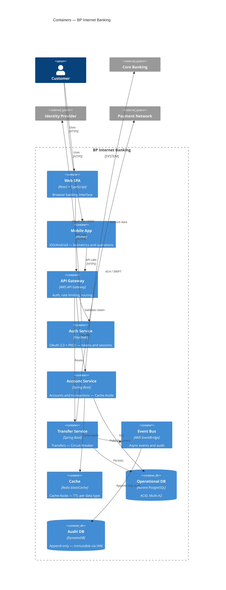

---

## 4. Component Diagrams (C4 — Level 3)

### 4.1 Transfer Service — Components

> Critical service: handles own and interbank transfers with Circuit Breaker fault tolerance.

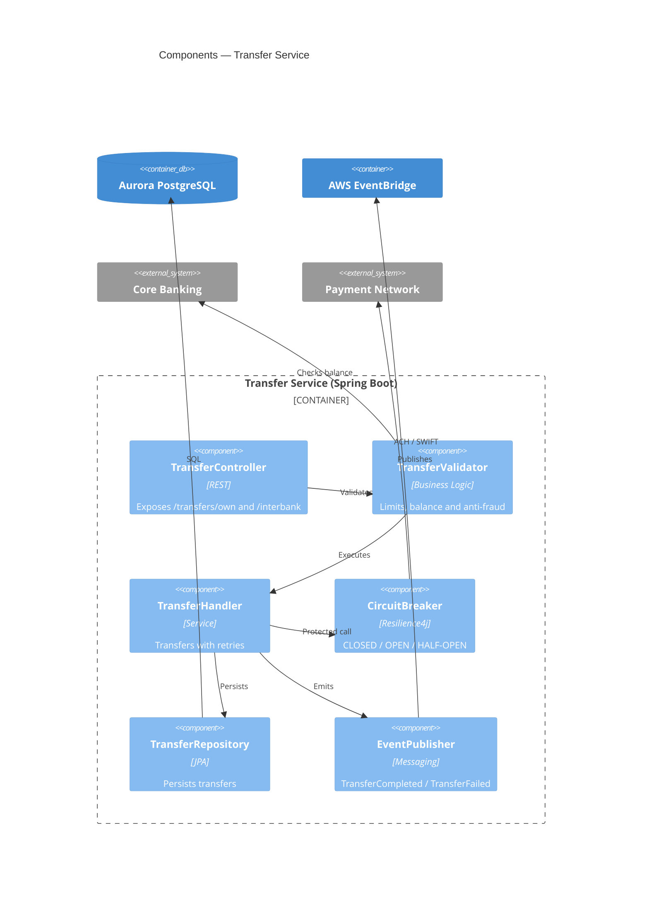

### 4.2 Auth Service — Components (Keycloak + PKCE)

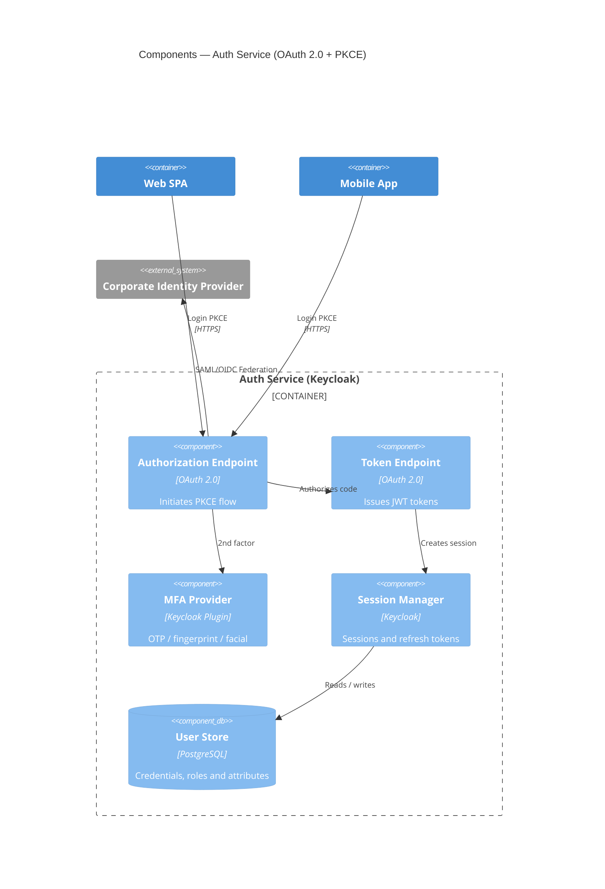

### 4.3 Account Service — Components (Cache-Aside)

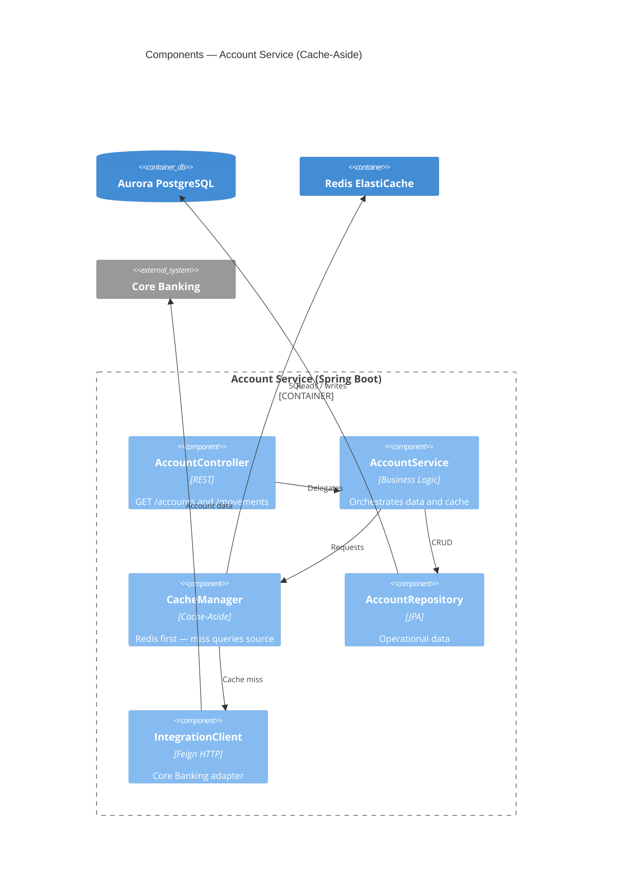

---

## 5. Authentication Architecture — OAuth 2.0 + PKCE

### Recommended Flow: Authorization Code Flow + PKCE

**Why Authorization Code + PKCE and not Implicit Flow?**

| Criterion | Implicit Flow | Authorization Code + PKCE |
|---|---|---|
| Token exposure | Access token in URL (insecure) | Only temporary code in URL |
| Mobile security | Not recommended (RFC 8252) | Recommended standard |
| Refresh token | Not supported | Yes, with rotation |
| Standard status | **Deprecated (OAuth 2.1)** | **Actively recommended** |

**Justification 1:** RFC 9700 / OAuth 2.1 removes Implicit Flow due to token leakage risk in URLs and logs. Authorization Code + PKCE mitigates this without requiring a `client_secret` in public apps.

**Justification 2:** RFC 8252 requires PKCE for mobile apps because they cannot securely store secrets. PKCE uses a device-generated `code_verifier`, making an intercepted authorization code useless.

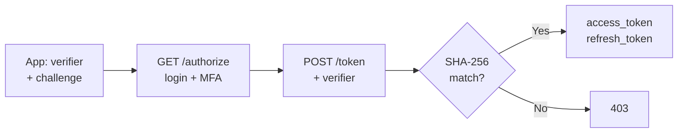

### Post-Onboarding Authentication Methods

| Method | Platform | Implementation |
|---|---|---|
| Username + password | Web + Mobile | Native Keycloak |
| Fingerprint | Mobile | Flutter LocalAuth + FIDO2 / WebAuthn |
| OTP via email/SMS | Web + Mobile | Keycloak OTP plugin |
| Facial recognition | Mobile | AWS Rekognition + Keycloak plugin |

---

## 6. Onboarding Architecture — Facial Recognition

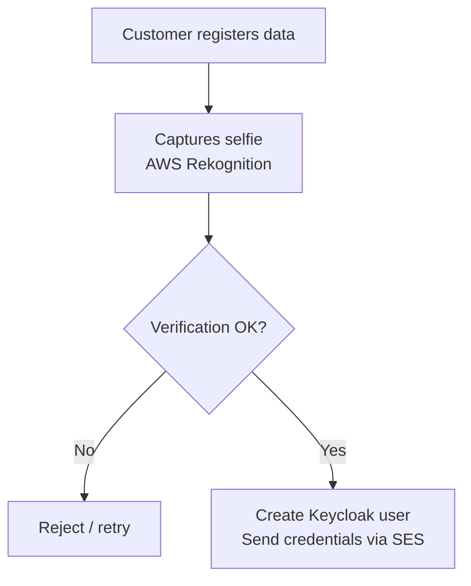

**Recommended tool:** AWS Rekognition — managed service, 99.9% SLA, no internal ML team required. Evaluated alternative: Azure Face API (similar capability, but BP already operates on AWS).

**Justification 1:** Using a managed service reduces time-to-market and eliminates model training complexity. Rekognition has >99.5% accuracy for 1:1 verification.

**Justification 2:** Separating Onboarding as an independent microservice allows scaling registration without affecting transactional service availability.

---

## 7. Cache Pattern — Cache-Aside

**Chosen pattern:** Cache-Aside (Lazy Loading)

**Justification 1:** Cache-Aside gives explicit control over what is cached. For sensitive banking data (balances, movements), selective invalidation is critical. Write-Through caches all writes including data that may never be read.

**Justification 2:** Core Banking is an external system we do not control. Cache-Aside is the only applicable pattern when the data source is a legacy external system with no native write-through support.

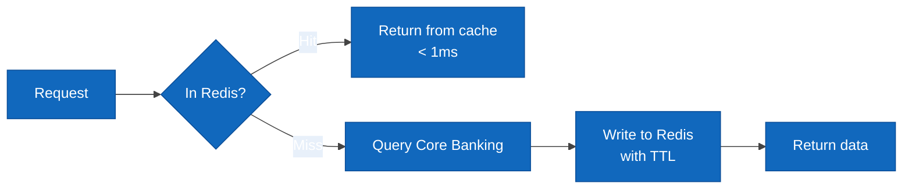

| Cached data | TTL | Reason |
|---|---|---|
| Customer profile | 15 min | Changes infrequently |
| Products / accounts | 5 min | May change due to new contracts |
| Recent movements | 2 min | High change frequency |
| Session token | Token duration | Fast validation without DB hit |

---

## 8. Integration Layer — API Gateway + Adapters

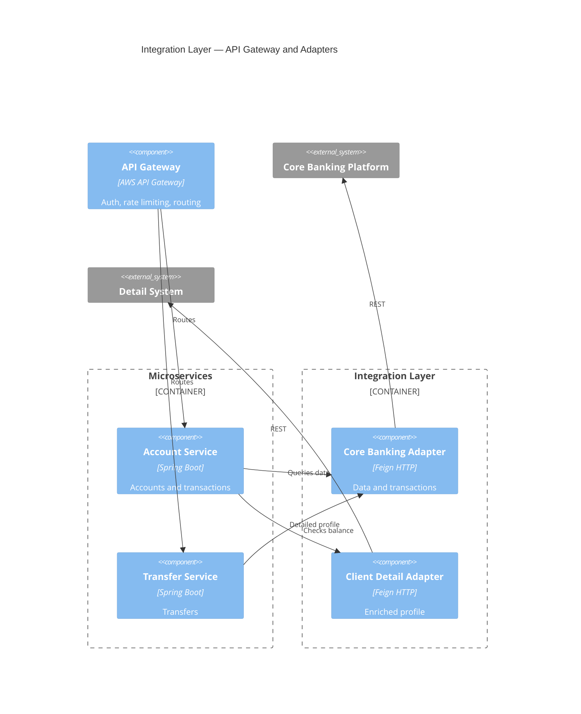

**Justification 1:** The API Gateway centralizes authentication, rate limiting and logging. Without it, each microservice would need to implement these cross-cutting concerns, violating DRY.

**Justification 2:** The Integration Layer with adapters per external system (Adapter Pattern) isolates legacy contracts. If Core Banking changes its API, only the adapter is updated, not the business services.

### Defined Services

| Service | Endpoint | Source |
|---|---|---|
| Basic data | `GET /accounts/{id}` | Core Banking |
| Movements | `GET /accounts/{id}/movements` | Core Banking |
| Own transfer | `POST /transfers/own` | Internal + Core |
| Interbank transfer | `POST /transfers/interbank` | Core + Payment Network |
| Customer detail | `GET /clients/{id}/profile` | Detail System |
| Notifications | `POST /notifications` (async) | EventBridge |

---

## 9. Notification Architecture

**Channel 1 — Email (AWS SES):** Transaction alerts, transfer confirmations, password recovery.

**Channel 2 — SMS (AWS SNS):** OTP for MFA, security alerts, critical confirmations.

**Pattern:** Event-Driven. Services publish events to EventBridge. The Notification Service subscribes and dispatches to the appropriate channel based on customer preferences.

**Justification:** Decoupling via EventBridge avoids direct dependency between Transfer Service and Notification Service. Using AWS SES + SNS as managed services guarantees 99.9% SLA and complies with financial communication regulations.

---

## 10. Audit Architecture

**Database:** AWS DynamoDB (append-only, no UPDATE or DELETE)

**Justification 1:** DynamoDB with IAM policy denying UpdateItem and DeleteItem guarantees audit record immutability, complying with SOX and banking regulations.

**Justification 2:** DynamoDB scales limitlessly, supports native TTL for automatic archival, and encrypts at rest by default — essential for long-term regulatory logs.

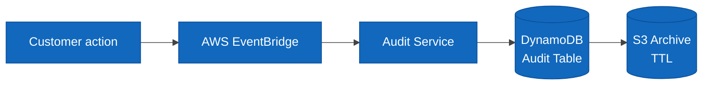

**Audit record schema:**

| Field | Type | Description |
|---|---|---|
| `auditId` | String (PK) | UUID v4 |
| `clientId` | String (SK) | Customer ID |
| `timestamp` | ISO 8601 | UTC date and time |
| `action` | String | LOGIN, TRANSFER, QUERY… |
| `sourceIP` | String | Source IP |
| `channel` | String | WEB / MOBILE |
| `result` | String | SUCCESS / FAILURE |

---

## 11. Cloud Infrastructure — AWS

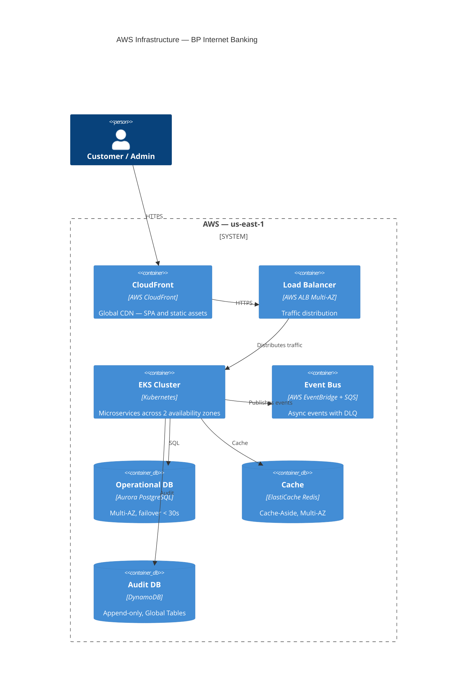

### AWS Services Used

| Service | Use | Justification |
|---|---|---|
| EKS (Kubernetes) | Microservice orchestration | Portability, auto-healing, HPA |
| Aurora PostgreSQL | Operational database | ACID, Multi-AZ, automatic failover < 30s |
| DynamoDB | Append-only audit | Unlimited scale, immutability via IAM, native TTL |
| ElastiCache Redis | Cache-Aside | Sub-millisecond latency, Multi-AZ |
| API Gateway | Entry gateway | Rate limiting, JWT validation, WAF |
| EventBridge + SQS | Event bus + DLQ | Decoupling, retries, fault tolerance |
| CloudFront | CDN for SPA | Low global latency, asset caching |
| Rekognition / SES / SNS | Biometrics + notifications | Managed services, 99.9% SLA |
| WAF + Shield | Perimeter security | DDoS protection, OWASP Top 10 |
| CloudWatch + X-Ray | Observability | Metrics, logs, distributed tracing |
| Secrets Manager | Secret management | Automatic rotation, no hardcoding |

---

## 12. High Availability, Fault Tolerance and Disaster Recovery

### High Availability

- **Multi-AZ:** All services deployed across minimum 2 availability zones
- **Auto Scaling:** Kubernetes HPA adjusts replicas based on CPU/RPS
- **Circuit Breaker:** Resilience4j prevents failure cascade to external systems
- **Aurora Multi-AZ:** Automatic failover in < 30 seconds

### Fault Tolerance

- **SQS Dead Letter Queue:** Failed events after 3 retries go to DLQ
- **Idempotency Keys:** Transfers include `idempotencyKey` to prevent duplicates
- **Graceful Degradation:** If Detail System fails, Account Service returns Core data
- **Timeout + Retry:** Exponential backoff on all HTTP clients

### Disaster Recovery

| RTO | RPO | Strategy |
|---|---|---|
| < 1 hour | < 5 min | Aurora Global Database — replica in secondary region |
| < 4 hours | < 1 hour | DynamoDB Global Tables replicated in us-west-2 |
| < 15 min | 0 (events) | EventBridge replay of archived events |

---

## 13. Security

| Layer | Control | Technology |
|---|---|---|
| Perimeter | DDoS, OWASP Top 10 | AWS WAF + Shield Advanced |
| Transport | Encryption in transit | TLS 1.3 on all channels |
| Authentication | JWT + PKCE + MFA | Keycloak |
| Authorization | RBAC by role and channel | Spring Security |
| Data at rest | AES-256 | AWS KMS on Aurora, DynamoDB, S3 |
| Secrets | No hardcoding | AWS Secrets Manager with rotation |
| Containers | Image scanning | Amazon ECR Image Scanning |

### Regulatory Compliance

| Regulation | Application |
|---|---|
| PCI DSS v4 | Card data — encryption, logging, network segmentation |
| SOX | Immutable audit trail, financial access controls |
| PSD2 / Open Banking | Strong Customer Authentication (SCA) — mandatory 2FA |
| Data Protection Law | Consent, right to erasure, data minimization |
| ISO 27001 | ISMS — security policies, risk management |

---

## 14. Monitoring and Operational Excellence

| Pillar | Tool | What it measures |
|---|---|---|
| Metrics | CloudWatch + Prometheus | CPU, memory, RPS, p95/p99 latency |
| Logs | CloudWatch Logs | Request traces, errors, audit |
| Traces | AWS X-Ray | Distributed tracing across microservices |
| Alerts | CloudWatch Alarms | Anomalies, errors, SLA breach |
| Dashboards | Grafana | Unified system health view |

### Production KPIs

| Metric | Target |
|---|---|
| Availability | 99.95% monthly |
| p95 latency (queries) | < 300ms |
| p95 latency (transfers) | < 2 seconds |
| Error rate | < 0.1% |
| Aurora failover | < 30 seconds |

---

## 15. Architectural Decisions (ADR)

| # | Decision | Chosen | Alternative | Justification |
|---|---|---|---|---|
| 1 | Architecture | Microservices | Monolith | Independent scalability per service |
| 2 | Orchestration | EKS (Kubernetes) | ECS Fargate | Portability, HPA, native self-healing |
| 3 | Operational DB | Aurora PostgreSQL | RDS MySQL | ACID, failover < 30s, read replicas |
| 4 | Audit DB | DynamoDB | PostgreSQL | Unlimited scale, immutability via IAM |
| 5 | Cache | Redis (ElastiCache) | Memcached | Persistence, pub/sub for invalidation |
| 6 | Messaging | EventBridge | Kafka | Less overhead, native AWS, declarative routing |
| 7 | Auth flow | Authorization Code + PKCE | Implicit Flow | RFC 8252 / OAuth 2.1 — standard for public apps |
| 8 | IdP | Keycloak | Custom | Existing corporate product, OAuth 2.0 / OIDC |
| 9 | Biometrics | AWS Rekognition | Azure Face API | BP on AWS — lower latency, no cross-cloud egress |
| 10 | Mobile | Flutter | React Native | Single codebase, native biometric API |
| 11 | SPA | React + TypeScript | Angular | Flexibility, TypeScript type safety |
| 12 | Cache pattern | Cache-Aside | Write-Through | External Core Banking; explicit invalidation control |
| 13 | Notifications | EventBridge + SES + SNS | Twilio | Native AWS, 99.9% SLA, lower cost |
| 14 | Gateway | AWS API Gateway | Kong | Less overhead, WAF integration, Lambda authorizer |

---

*Architecture designed under the C4 model — Context · Container · Component*
