# Solution Architecture: BP Internet Banking

**C4 Design · Internet Banking System**

Document following the C4 model (Context, Container, Component) with architectural justifications per exercise requirements.

---

## 1. Executive Summary

This document lays out an internet banking platform for BP covering account visibility, own and interbank transfers, and real-time notifications. The architecture is built on **microservices on AWS**: two front-end channels (SPA + Mobile App), OAuth 2.0 + PKCE authentication with biometric onboarding, a unified API Gateway, append-only audit logging, and multi-region availability. The guiding principle throughout was keeping each service independently deployable and scalable so the system can grow without a structural rewrite.

---

## 2. Context Diagram (C4 — Level 1)

High-level view for non-technical stakeholders. Shows what BP Internet Banking does and which external systems it depends on.

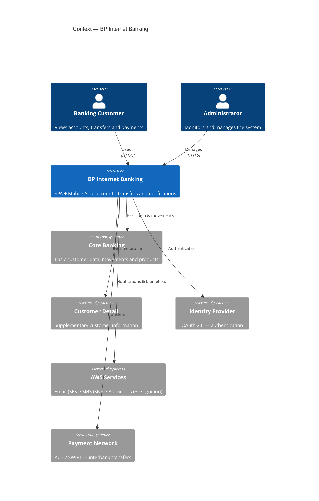

### Actors and External Systems

| Actor / System | Type | Role |
|---|---|---|
| Banking Customer | Person | Retail user — accounts, history, transfers |
| Operations Administrator | Person | Internal staff — monitoring and alerts |
| Core Banking Platform | External system | Primary source: basic customer data, movements, products |
| Customer Detail System | External system | Supplementary information for enriched customer profiles |
| Identity Provider (OAuth 2.0) | External system | Issues and validates tokens |
| AWS Services (SES · SNS · Rekognition) | External system | Email alerts, SMS/OTP, facial verification |
| ACH/SWIFT Payment Network | External system | Interbank transfer execution |

---

## 3. Container Diagrams (C4 — Level 2)

Technical detail of the main deployment units. Split into two views to keep each readable: channels and authentication on the left, domain services and data on the right.

<h3>3a. Channels and Authentication</h3>

Shows user-facing containers and the authentication flow. Entry point for all client interactions.

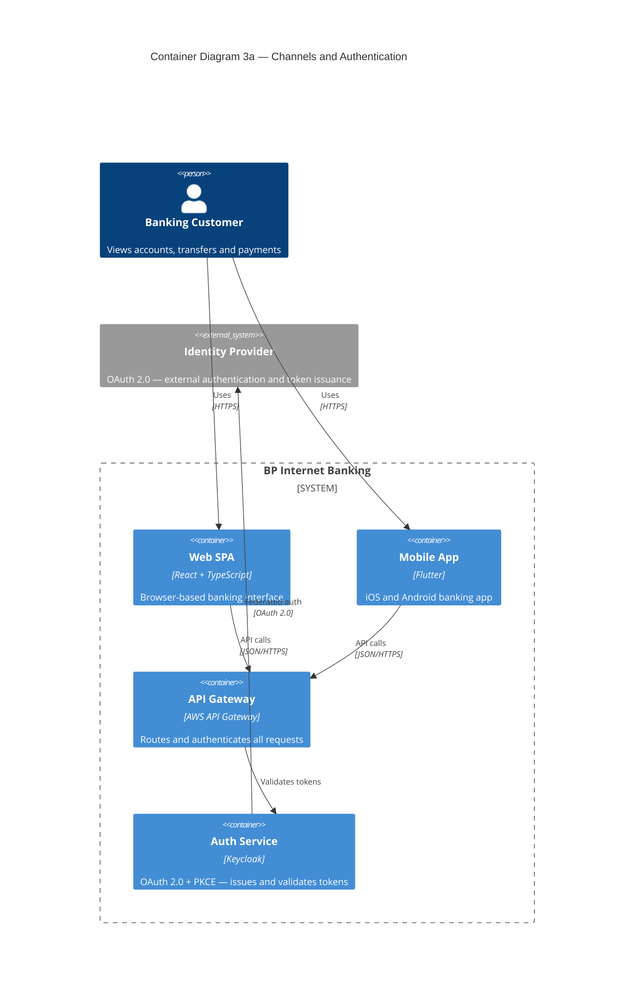

<h3>3b. Business Services and Data</h3>

Shows domain services, data stores and external integrations. API Gateway is referenced from diagram 3a.

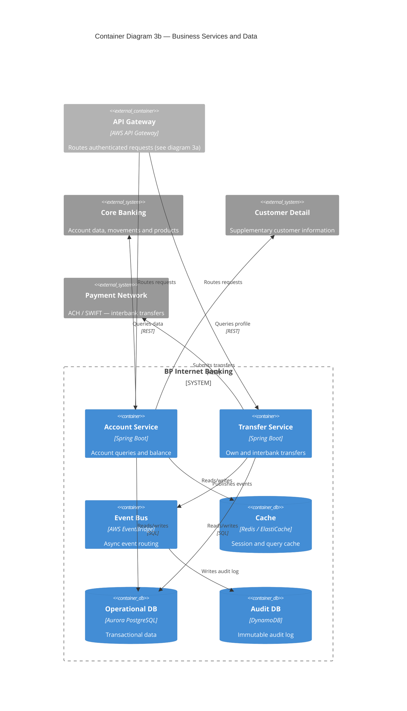

---

## 4. Component Diagrams (C4 — Level 3)

<h3>4.1 Transfer Service — Components</h3>

Critical service: handles own and interbank transfers with Circuit Breaker fault tolerance.

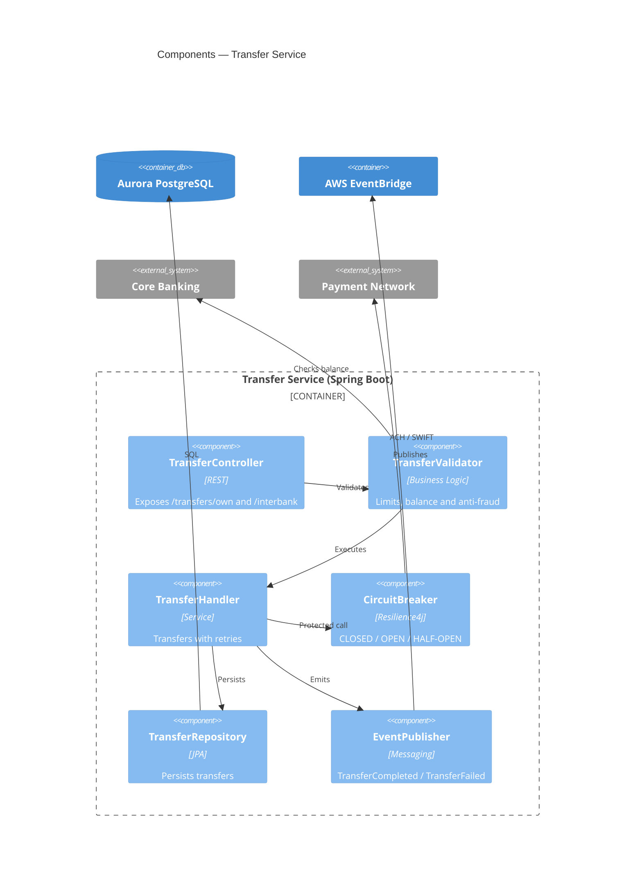

<h3>4.2 Auth Service — Components (Keycloak + PKCE)</h3>

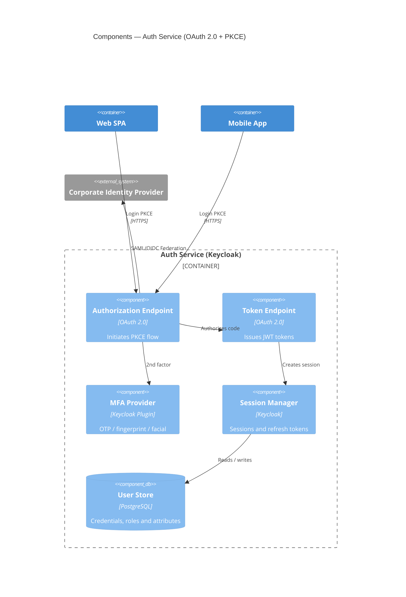

### 4.3 Account Service — Components (Cache-Aside)

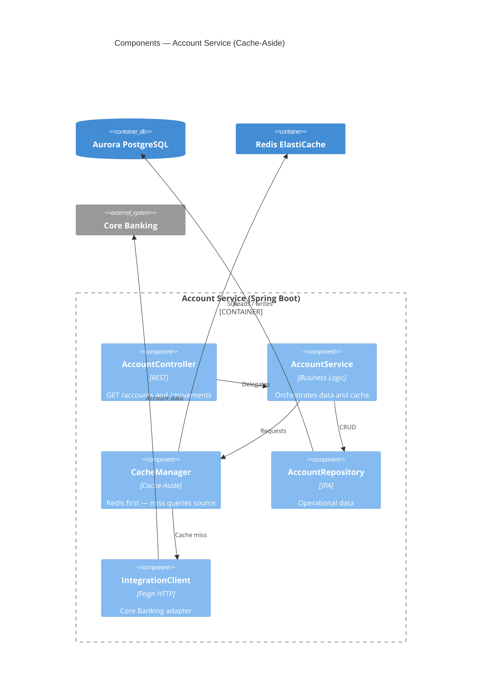

---

## 5. Authentication Architecture: OAuth 2.0 + PKCE

### Recommended Flow: Authorization Code Flow + PKCE

**Why Authorization Code + PKCE and not Implicit Flow?**

| Criterion | Implicit Flow | Authorization Code + PKCE |
|---|---|---|
| Token exposure | Access token in URL (insecure) | Only temporary code in URL |
| Mobile security | Not recommended (RFC 8252) | Recommended standard |
| Refresh token | Not supported | Yes, with rotation |
| Standard status | **Deprecated (OAuth 2.1)** | **Actively recommended** |

RFC 9700 / OAuth 2.1 formally deprecates Implicit Flow — access tokens ending up in URL fragments and server logs is a real exposure in a banking context. Authorization Code + PKCE eliminates that without requiring a `client_secret` embedded in the app, which matters for public clients like SPAs and mobile apps. RFC 8252 is equally specific: PKCE is mandatory for mobile because phones can't safely store secrets. The `code_verifier` is generated on-device at login time, so anyone who intercepts the authorization code in transit gets nothing useful without it.

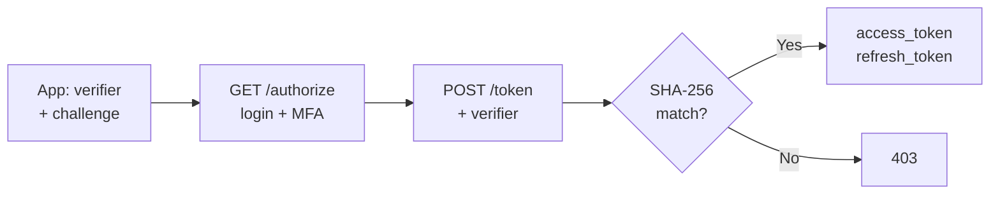

### Post-Onboarding Authentication Methods

| Method | Platform | Implementation |
|---|---|---|
| Username + password | Web + Mobile | Native Keycloak |
| Fingerprint | Mobile | Flutter LocalAuth + FIDO2 / WebAuthn |
| OTP via email/SMS | Web + Mobile | Keycloak OTP plugin |
| Facial recognition | Mobile | AWS Rekognition + Keycloak plugin |

---

## 6. Onboarding Architecture — Facial Recognition

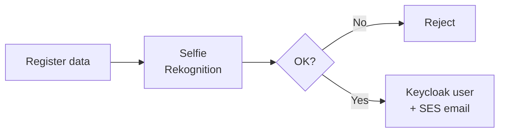

AWS Rekognition handles facial verification — managed service, no ML team required, >99.5% accuracy for 1:1 verification, and BP is already on AWS. Azure Face API was evaluated and has comparable capabilities, but introducing a cross-cloud dependency just for biometrics adds latency and a new vendor to audit for financial compliance. Not worth it. Onboarding runs as its own microservice precisely so registration spikes during campaigns don't touch the transactional services at all.

---

## 7. Cache Pattern — Cache-Aside

**Chosen pattern:** Cache-Aside (Lazy Loading)

Cache-Aside was the only realistic option here. Core Banking is a legacy external system — there's no way to hook writes on the source side, which rules out Write-Through entirely. Beyond that, banking data requires selective invalidation: balances and movements have very different change frequencies, and a blanket cache-all-writes approach would serve stale data. Cache-Aside lets each service decide exactly what to cache, with TTLs tuned per data type.

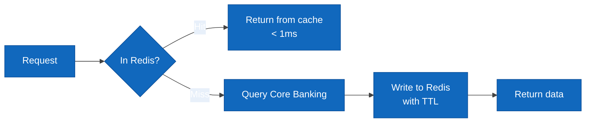

| Cached data | TTL | Reason |
|---|---|---|
| Customer profile | 15 min | Changes infrequently |
| Products / accounts | 5 min | May change due to new contracts |
| Recent movements | 2 min | High change frequency |
| Session token | Token duration | Fast validation without DB hit |

---

## 8. Integration Layer — API Gateway + Adapters

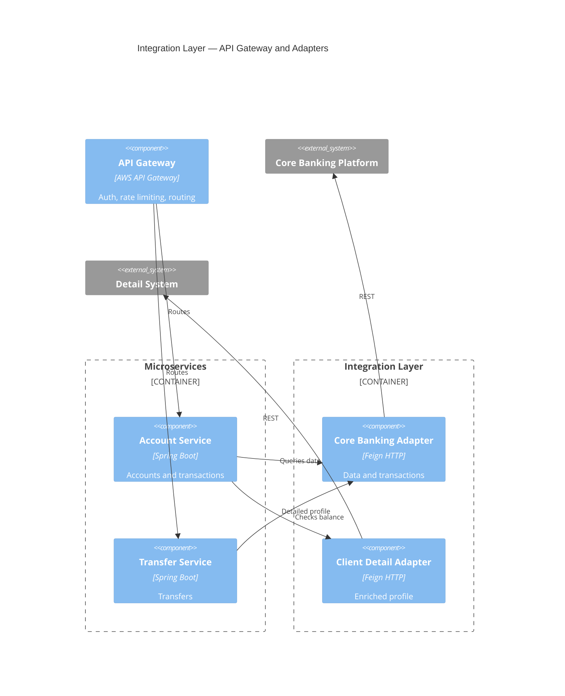

The API Gateway centralizes cross-cutting concerns — auth validation, rate limiting, WAF, request logging — that have no business being duplicated across every microservice. The Integration Layer underneath uses the Adapter Pattern: one dedicated client per external system. If Core Banking changes its API contract, only the Core Banking adapter needs updating; the business services never need to know.

### Defined Services

| Service | Endpoint | Source |
|---|---|---|
| Basic data | `GET /accounts/{id}` | Core Banking |
| Movements | `GET /accounts/{id}/movements` | Core Banking |
| Own transfer | `POST /transfers/own` | Internal + Core |
| Interbank transfer | `POST /transfers/interbank` | Core + Payment Network |
| Customer detail | `GET /clients/{id}/profile` | Detail System |
| Notifications | `POST /notifications` (async) | EventBridge |

---

## 9. Notification Architecture

**Email (AWS SES):** Transaction alerts, transfer confirmations, password recovery.

**SMS (AWS SNS):** OTP for MFA, security alerts, critical confirmations.

**Pattern:** Event-Driven. Services publish events to EventBridge. The Notification Service subscribes and dispatches to the appropriate channel based on customer preferences.

The event-driven approach here is non-negotiable. If the notification service is down, the transfer still completes — the event sits in SQS until the service recovers. A direct synchronous call would mean a notification outage blocks every transfer, which is unacceptable. SES and SNS were chosen over Twilio: the delivery guarantees are comparable (both 99.9% SLA), but native AWS services avoid a third-party vendor dependency, cross-cloud data egress fees, and one more integration to audit for financial regulatory compliance.

---

## 10. Audit Architecture

**Database:** AWS DynamoDB (append-only, no UPDATE or DELETE)

DynamoDB is a deliberate choice for audit storage. An IAM policy that denies `UpdateItem` and `DeleteItem` makes records physically immutable — enforced at the infrastructure level, not just by convention. That's exactly what SOX requires. The practical advantages add up: unlimited scale, native TTL for automatic archival to S3, and encryption at rest by default. A relational database could technically work, but you'd need extra safeguards to achieve the same immutability guarantees, and audit tables grow indefinitely in a way that doesn't suit a relational model.

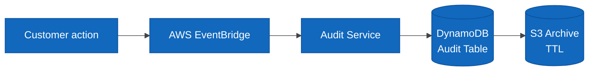

**Audit record schema:**

| Field | Type | Description |
|---|---|---|
| `auditId` | String (PK) | UUID v4 |
| `clientId` | String (SK) | Customer ID |
| `timestamp` | ISO 8601 | UTC date and time |
| `action` | String | LOGIN, TRANSFER, QUERY… |
| `sourceIP` | String | Source IP |
| `channel` | String | WEB / MOBILE |
| `result` | String | SUCCESS / FAILURE |

---

## 11. Cloud Infrastructure — AWS

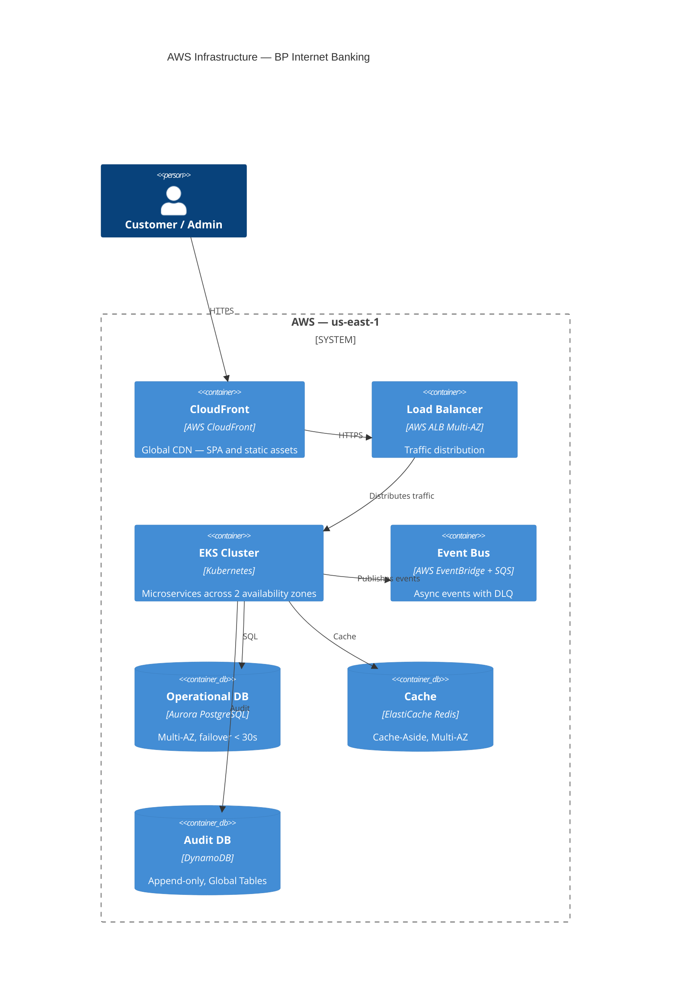

### AWS Services Used

| Service | Use | Justification |
|---|---|---|
| EKS (Kubernetes) | Microservice orchestration | Portability, auto-healing, HPA |
| Aurora PostgreSQL | Operational database | ACID, Multi-AZ, automatic failover < 30s |
| DynamoDB | Append-only audit | Unlimited scale, immutability via IAM, native TTL |
| ElastiCache Redis | Cache-Aside | Sub-millisecond latency, Multi-AZ |
| API Gateway | Entry gateway | Rate limiting, JWT validation, WAF |
| EventBridge + SQS | Event bus + DLQ | Decoupling, retries, fault tolerance |
| CloudFront | CDN for SPA | Low global latency, asset caching |
| Rekognition / SES / SNS | Biometrics + notifications | Managed services, 99.9% SLA |
| WAF + Shield | Perimeter security | DDoS protection, OWASP Top 10 |
| CloudWatch + X-Ray | Observability | Metrics, logs, distributed tracing |
| Secrets Manager | Secret management | Automatic rotation, no hardcoding |

### Cost Management

The cost model leans on pay-per-use managed services to avoid over-provisioning. The only meaningful fixed cost is EKS + EC2 nodes; everything else scales with actual traffic.

| Service | Billing model (verified) | Monthly estimate (medium load) | Optimization lever |
|---|---|---|---|
| EKS Cluster | $0.10/cluster/hr + EC2 nodes | ~$73 cluster + ~$90 nodes (3× t3.medium @ $0.0416/hr) | Karpenter autoscaler — scale to zero off-peak |
| Aurora PostgreSQL | ~$0.12/ACU-hr (Serverless v2) | ~$200–350 (avg 4 ACU × 720 hr) | Serverless v2 scales with traffic, no over-provisioning |
| DynamoDB | $0.625/M writes · $0.125/M reads | ~$25 (audit-only, low write volume + TTL cleanup) | TTL auto-expires old records, reduces storage cost |
| ElastiCache Redis | ~$0.068/node-hr (cache.t3.medium) | ~$98 (2× nodes × 720 hr, Multi-AZ) | Tune TTLs to maximize hit rate; evict stale data |
| API Gateway | $1.00/M requests (first 300M) | ~$10 (10M requests/month) | Response caching reduces EKS invocations |
| EventBridge + SQS | Per event/message (low volume) | ~$5 | Batching reduces per-event cost |
| CloudFront | $0.085/GB (US, first 10 TB) | ~$9 (100 GB/month) | Cache-Control headers maximize CDN hit rate |
| AWS SES | $0.10/1K emails | ~$1 (10K emails/month) | Suppress non-critical emails to reduce volume |
| CloudWatch | $0.50/GB ingested (standard) | ~$15 (30 GB/month) | Set log retention to 30 days; export to S3 for long-term |
| **Total estimate** | | **~$600–850 / month** | Scales with actual load (serverless/on-demand services) |

AWS Budgets alerts at 80% and 100% of the monthly target. Cost Explorer tags are set per service so spending can be attributed by domain if needed.

---

## 12. High Availability, Fault Tolerance and Disaster Recovery

### High Availability

- **Multi-AZ:** All services deployed across minimum 2 availability zones
- **Auto Scaling:** Kubernetes HPA adjusts replicas based on CPU/RPS
- **Circuit Breaker:** Resilience4j prevents failure cascade to external systems
- **Aurora Multi-AZ:** Automatic failover in < 30 seconds

### Fault Tolerance

- **SQS Dead Letter Queue:** Failed events after 3 retries go to DLQ
- **Idempotency Keys:** Transfers include `idempotencyKey` to prevent duplicates
- **Graceful Degradation:** If Detail System fails, Account Service returns Core data
- **Timeout + Retry:** Exponential backoff on all HTTP clients

### Disaster Recovery

| RTO | RPO | Strategy |
|---|---|---|
| < 1 hour | < 5 min | Aurora Global Database — replica in secondary region |
| < 4 hours | < 1 hour | DynamoDB Global Tables replicated in us-west-2 |
| < 15 min | 0 (events) | EventBridge replay of archived events |

---

## 13. Security

| Layer | Control | Technology |
|---|---|---|
| Perimeter | DDoS, OWASP Top 10 | AWS WAF + Shield Advanced |
| Transport | Encryption in transit | TLS 1.3 on all channels |
| Authentication | JWT + PKCE + MFA | Keycloak |
| Authorization | RBAC by role and channel | Spring Security |
| Data at rest | AES-256 | AWS KMS on Aurora, DynamoDB, S3 |
| Secrets | No hardcoding | AWS Secrets Manager with rotation |
| Containers | Image scanning | Amazon ECR Image Scanning |

### Regulatory Compliance

| Regulation | Application |
|---|---|
| PCI DSS v4 | Card data — encryption, logging, network segmentation |
| SOX | Immutable audit trail, financial access controls |
| PSD2 / Open Banking | Strong Customer Authentication (SCA) — mandatory 2FA |
| Data Protection Law | Consent, right to erasure, data minimization |
| ISO 27001 | ISMS — security policies, risk management |

---

## 14. Monitoring and Operational Excellence

| Pillar | Tool | What it measures |
|---|---|---|
| Metrics | CloudWatch + Prometheus | CPU, memory, RPS, p95/p99 latency |
| Logs | CloudWatch Logs | Request traces, errors, audit |
| Traces | AWS X-Ray | Distributed tracing across microservices |
| Alerts | CloudWatch Alarms | Anomalies, errors, SLA breach |
| Dashboards | Grafana | Unified system health view |

### Production KPIs

| Metric | Target |
|---|---|
| Availability | 99.95% monthly |
| p95 latency (queries) | < 300ms |
| p95 latency (transfers) | < 2 seconds |
| Error rate | < 0.1% |
| Aurora failover | < 30 seconds |

---

## 15. Architectural Decisions (ADR)

| # | Decision | Chosen | Alternative | Justification |
|---|---|---|---|---|
| 1 | Architecture | Microservices | Monolith | Independent scalability per service |
| 2 | Orchestration | EKS (Kubernetes) | ECS Fargate | Portability, HPA, native self-healing |
| 3 | Operational DB | Aurora PostgreSQL | RDS MySQL | ACID, failover < 30s, read replicas |
| 4 | Audit DB | DynamoDB | PostgreSQL | Unlimited scale, immutability via IAM |
| 5 | Cache | Redis (ElastiCache) | Memcached | Persistence, pub/sub for invalidation |
| 6 | Messaging | EventBridge | Kafka | Less overhead, native AWS, declarative routing |
| 7 | Auth flow | Authorization Code + PKCE | Implicit Flow | RFC 8252 / OAuth 2.1 — standard for public apps |
| 8 | IdP | Keycloak | Custom | Existing corporate product, OAuth 2.0 / OIDC |
| 9 | Biometrics | AWS Rekognition | Azure Face API | BP on AWS — lower latency, no cross-cloud egress |
| 10 | Mobile | Flutter | React Native | Single codebase, native biometric API |
| 11 | SPA | React + TypeScript | Angular | Flexibility, TypeScript type safety |
| 12 | Cache pattern | Cache-Aside | Write-Through | External Core Banking; explicit invalidation control |
| 13 | Notifications | EventBridge + SES + SNS | Twilio | Native AWS, 99.9% SLA, lower cost |
| 14 | Gateway | AWS API Gateway | Kong | Less overhead, WAF integration, Lambda authorizer |

---

Architecture designed under the C4 model: Context, Container, Component
