# Arquitectura de Solución — BP Internet Banking

**Diseño C4 · Sistema de Banca por Internet**

> Documento elaborado siguiendo el modelo C4 (Context → Container → Component) con justificación teórica por cada decisión arquitectónica, conforme a los requisitos del ejercicio.

---

## 1. Resumen Ejecutivo

BP requiere un sistema de banca por internet que permita a sus clientes consultar movimientos, realizar transferencias propias e interbancarias, y recibir notificaciones en tiempo real. La solución propuesta es una **arquitectura de microservicios sobre AWS**, con dos canales de front-end (SPA + App Móvil), autenticación OAuth 2.0 con PKCE, onboarding biométrico, capa de integración centralizada, auditoría append-only y alta disponibilidad multi-región.

---

## 2. Diagrama de Contexto (C4 — Nivel 1)

> Para audiencias no técnicas. Muestra el sistema BP Internet Banking y sus relaciones con usuarios y sistemas externos.

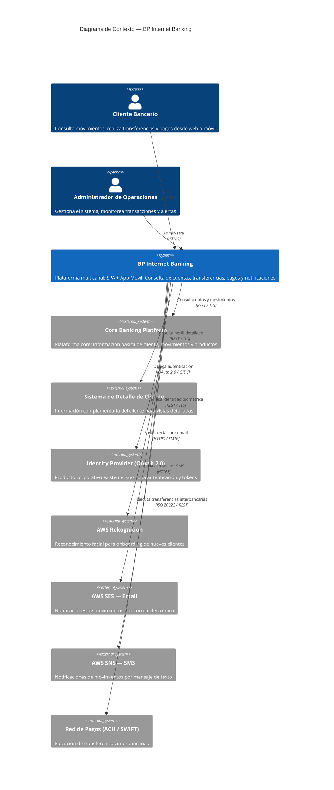

### Actores y Sistemas Externos

| Actor / Sistema | Tipo | Rol |
|---|---|---|
| Cliente Bancario | Persona | Usuario retail — accede a cuentas, historial, transferencias |
| Administrador de Operaciones | Persona | Staff interno — monitoreo, configuración, alertas |
| Core Banking Platform | Sistema externo | Fuente principal de datos: cliente, movimientos, productos |
| Sistema de Detalle de Cliente | Sistema externo | Información complementaria para vistas enriquecidas |
| Identity Provider (OAuth 2.0) | Sistema externo | Producto corporativo existente — emite y valida tokens |
| AWS Rekognition | Sistema externo | Verificación facial en onboarding móvil |
| AWS SES (Email) | Sistema externo | Canal de notificación 1 — alertas transaccionales por email |
| AWS SNS (SMS) | Sistema externo | Canal de notificación 2 — alertas transaccionales por SMS |
| Red de Pagos ACH/SWIFT | Sistema externo | Ejecución de transferencias interbancarias |

---

## 3. Diagrama de Contenedores (C4 — Nivel 2)

> Para audiencias técnicas. Muestra aplicaciones, servicios, bases de datos y mensajería. Incluye tecnologías y protocolos de comunicación.

```mermaid
C4Container
  title Diagrama de Contenedores — BP Internet Banking

  Person(customer, "Cliente Bancario")
  Person(admin, "Administrador")

  System_Boundary(bp, "BP Internet Banking") {
    Container(spa, "SPA Web", "React 18 + TypeScript", "Interfaz bancaria para navegador — consultas, transferencias y pagos")
    Container(mobile, "App Móvil", "Flutter 3", "App iOS/Android — onboarding biométrico, autenticación por huella y operaciones bancarias")
    Container(api_gateway, "API Gateway", "AWS API Gateway", "Punto de entrada único: rate limiting, validación de token JWT, enrutamiento")
    Container(auth_svc, "Auth Service", "Keycloak (OAuth 2.0 / OIDC)", "Emisión de tokens, refresh, revocación. Flujo Authorization Code + PKCE")
    Container(onboarding_svc, "Onboarding Service", "Node.js + Express", "Registro de nuevos clientes — verificación facial y alta en IdP")
    Container(account_svc, "Account Service", "Java + Spring Boot", "Consulta de datos de cliente y productos. Cache-Aside sobre Redis")
    Container(movement_svc, "Movement Service", "Java + Spring Boot", "Consulta de historial de movimientos y estados de cuenta")
    Container(transfer_svc, "Transfer Service", "Java + Spring Boot", "Transferencias propias e interbancarias con circuit breaker")
    Container(notification_svc, "Notification Service", "Node.js", "Dispatcher de alertas multicanal: email y SMS")
    Container(audit_svc, "Audit Service", "Java + Spring Boot", "Registro append-only de todas las acciones del cliente")
    Container(integration_layer, "Integration Layer", "Spring Boot + RestTemplate", "Adaptadores hacia Core Banking y Sistema de Detalle")
    Container(event_bus, "Event Bus", "AWS EventBridge", "Enrutamiento de eventos asincrónicos entre microservicios")
    Container(cache, "Cache", "AWS ElastiCache — Redis", "Cache-Aside para clientes frecuentes. TTL configurable por tipo de dato")
    ContainerDb(ops_db, "Base de Datos Operacional", "AWS Aurora PostgreSQL", "Datos transaccionales con ACID, Multi-AZ y réplicas de lectura")
    ContainerDb(audit_db, "Base de Datos de Auditoría", "AWS DynamoDB", "Registro append-only, infinitamente escalable, TTL y cifrado en reposo")
  }

  System_Ext(core_platform, "Core Banking Platform")
  System_Ext(client_detail, "Sistema de Detalle")
  System_Ext(idp_ext, "Identity Provider")
  System_Ext(rekognition, "AWS Rekognition")
  System_Ext(ses, "AWS SES")
  System_Ext(sns, "AWS SNS")
  System_Ext(payment_net, "Red de Pagos")

  Rel(customer, spa, "Usa", "HTTPS")
  Rel(customer, mobile, "Usa", "HTTPS")
  Rel(admin, api_gateway, "Administra", "HTTPS")
  Rel(spa, api_gateway, "Llamadas API", "HTTPS + JWT")
  Rel(mobile, api_gateway, "Llamadas API", "HTTPS + JWT")
  Rel(api_gateway, auth_svc, "Valida token", "HTTPS")
  Rel(api_gateway, account_svc, "Enruta", "HTTPS")
  Rel(api_gateway, movement_svc, "Enruta", "HTTPS")
  Rel(api_gateway, transfer_svc, "Enruta", "HTTPS")
  Rel(api_gateway, onboarding_svc, "Enruta", "HTTPS")
  Rel(auth_svc, idp_ext, "Delega autenticación", "OAuth 2.0 / OIDC")
  Rel(onboarding_svc, rekognition, "Verifica biometría", "REST / TLS")
  Rel(onboarding_svc, auth_svc, "Crea usuario en IdP", "REST")
  Rel(account_svc, cache, "Lee / escribe caché", "Redis")
  Rel(account_svc, integration_layer, "Consulta datos", "REST")
  Rel(movement_svc, integration_layer, "Consulta movimientos", "REST")
  Rel(integration_layer, core_platform, "Lee datos core", "REST / TLS")
  Rel(integration_layer, client_detail, "Lee detalle de cliente", "REST / TLS")
  Rel(transfer_svc, ops_db, "Lee / escribe", "SQL")
  Rel(transfer_svc, payment_net, "Ejecuta transferencia", "ISO 20022")
  Rel(transfer_svc, event_bus, "Publica evento", "EventBridge")
  Rel(account_svc, ops_db, "Lee / escribe", "SQL")
  Rel(event_bus, notification_svc, "Dispara alerta", "EventBridge")
  Rel(event_bus, audit_svc, "Dispara auditoría", "EventBridge")
  Rel(notification_svc, ses, "Envía email", "HTTPS")
  Rel(notification_svc, sns, "Envía SMS", "HTTPS")
  Rel(audit_svc, audit_db, "Escribe registro", "DynamoDB SDK")
```

---

## 4. Diagrama de Componentes (C4 — Nivel 3)

### 4.1 Transfer Service — Componentes

> El servicio más crítico. Maneja transferencias propias e interbancarias con tolerancia a fallos y patrón Cache-Aside.

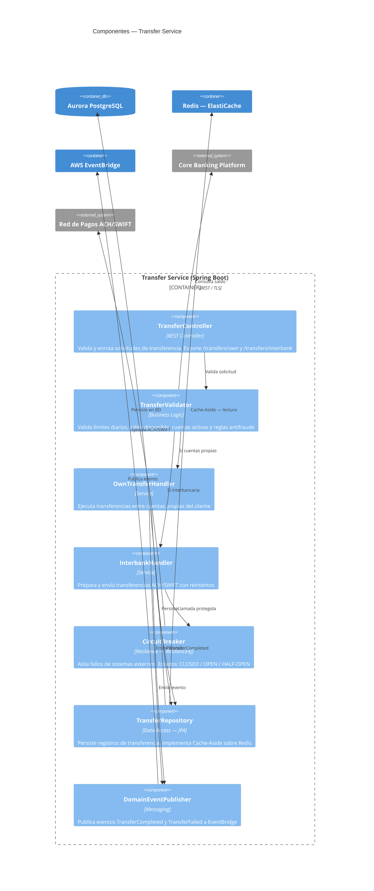

### 4.2 Auth Service — Componentes (Keycloak + PKCE)

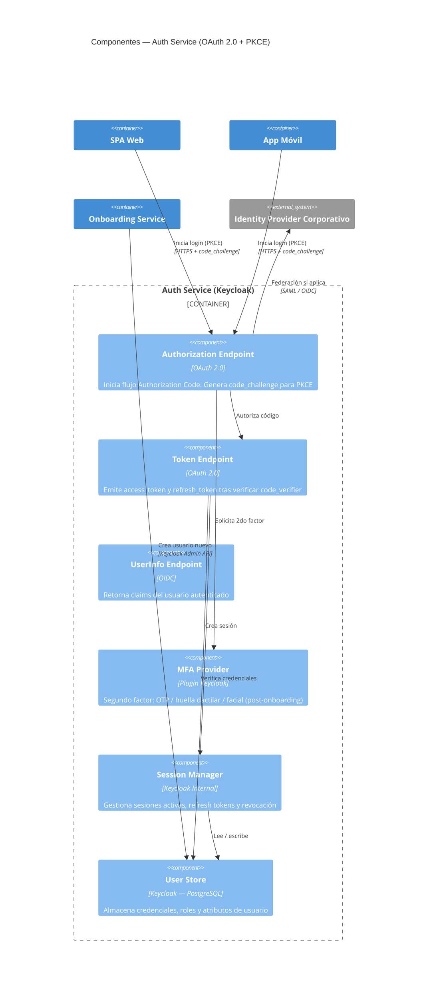

### 4.3 Account Service — Componentes (Cache-Aside)

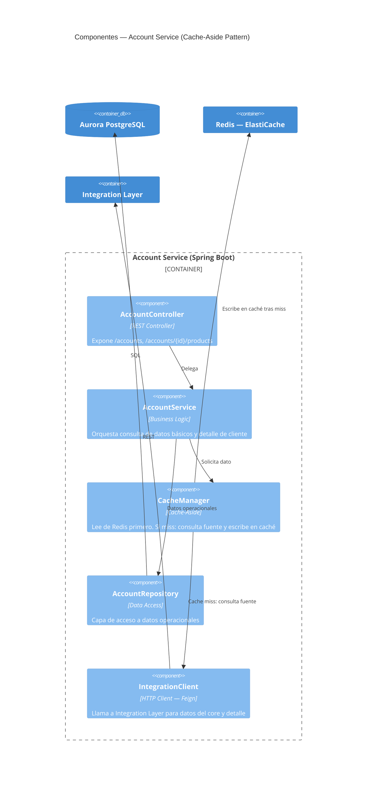

---

## 5. Arquitectura de Autenticación — OAuth 2.0 + PKCE

### Flujo Recomendado: Authorization Code Flow + PKCE

**¿Por qué Authorization Code + PKCE y no Implicit Flow?**

| Criterio | Implicit Flow | Authorization Code + PKCE |
|---|---|---|
| Exposición del token | Access token en URL (inseguro) | Solo código temporal en URL |
| Seguridad en mobile | No recomendado (RFC 8252) | Estándar recomendado |
| Refresh token | No soportado | Sí, con rotación |
| Estado del estándar | **Deprecado (OAuth 2.1)** | **Recomendado activo** |

**Justificación 1:** RFC 9700 / OAuth 2.1 elimina el Implicit Flow por riesgo de token leakage en la URL y logs. Authorization Code + PKCE mitiga este riesgo sin requerir client_secret en apps públicas.

**Justificación 2:** RFC 8252 ("OAuth 2.0 for Native Apps") exige PKCE para aplicaciones móviles porque no pueden guardar secretos de forma segura. PKCE usa un `code_verifier` generado en el dispositivo, lo que hace el código de autorización inútil si es interceptado.

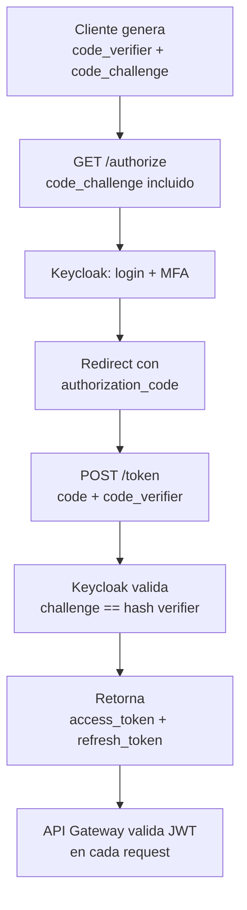

### Métodos de Autenticación Post-Onboarding

| Método | Plataforma | Implementación |
|---|---|---|
| Usuario + contraseña | Web + Móvil | Keycloak nativo |
| Huella dactilar | Móvil | Flutter LocalAuth + FIDO2 / WebAuthn |
| OTP por email/SMS | Web + Móvil | Keycloak OTP plugin |
| Reconocimiento facial | Móvil (futuro) | AWS Rekognition + Keycloak plugin |

---

## 6. Arquitectura de Onboarding — Reconocimiento Facial

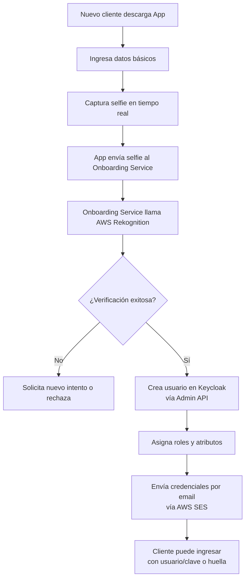

**Herramienta recomendada:** AWS Rekognition — servicio gestionado, SLA 99.9%, sin necesidad de equipo de ML interno. Alternativa evaluada: Azure Face API (similar capacidad, pero BP ya opera en AWS).

**Justificación 1:** Usar un servicio gestionado (Rekognition) reduce el time-to-market y elimina la complejidad de entrenar y mantener modelos propios. Rekognition tiene precisión >99.5% para verificación 1:1.

**Justificación 2:** Separar el Onboarding Service como microservicio independiente permite escalar el flujo de alta de clientes sin afectar la disponibilidad de los servicios transaccionales.

---

## 7. Patrón de Caché para Clientes Frecuentes — Cache-Aside

**Patrón elegido:** Cache-Aside (Lazy Loading)

**¿Por qué Cache-Aside y no Write-Through o Read-Through?**

**Justificación 1:** Cache-Aside da control explícito sobre qué se cachea. Para datos bancarios sensibles (saldos, movimientos), es crítico poder invalidar selectivamente. Write-Through cachea todos los writes, incluyendo datos que quizás nunca se lean.

**Justificación 2:** El Core Banking Platform es un sistema externo que no controlamos. Cache-Aside es el único patrón aplicable cuando la fuente de datos es un sistema legado externo sin soporte para write-through nativo.

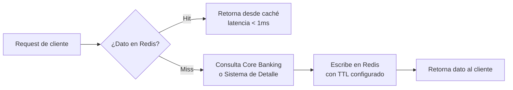

| Dato cacheado | TTL | Razón |
|---|---|---|
| Perfil básico del cliente | 15 min | Cambia poco frecuente |
| Productos / cuentas | 5 min | Puede cambiar por nuevas contrataciones |
| Últimos movimientos | 2 min | Alta frecuencia de cambio |
| Token de sesión | Duración del token | Validación rápida sin hit a BD |

---

## 8. Capa de Integración — API Gateway + Adaptadores

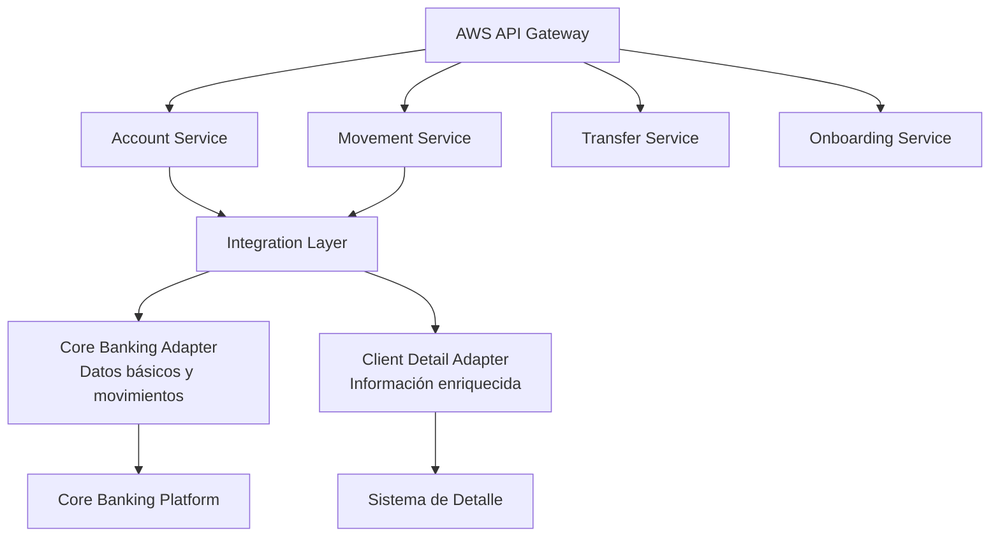

**Justificación 1:** El API Gateway centraliza autenticación, rate limiting y logging. Sin él, cada microservicio necesitaría implementar estas preocupaciones transversales, violando DRY y generando inconsistencias.

**Justificación 2:** La Integration Layer con adaptadores por sistema externo (Adapter Pattern) aísla los contratos de los sistemas legados. Si el Core Banking Platform cambia su API, solo se actualiza el adaptador, no los microservicios de negocio.

### Servicios definidos

| Servicio | Endpoint | Fuente |
|---|---|---|
| Consulta datos básicos | `GET /accounts/{id}` | Core Banking |
| Consulta movimientos | `GET /accounts/{id}/movements` | Core Banking |
| Transferencia propia | `POST /transfers/own` | Interno + Core |
| Transferencia interbancaria | `POST /transfers/interbank` | Core + Red de Pagos |
| Detalle de cliente | `GET /clients/{id}/profile` | Sistema de Detalle |
| Notificaciones | `POST /notifications` (async) | EventBridge |

---

## 9. Arquitectura de Notificaciones

**Canal 1 — Email (AWS SES):** Alertas de movimientos, confirmaciones de transferencia, recuperación de contraseña.

**Canal 2 — SMS (AWS SNS):** OTP para MFA, alertas de seguridad, confirmaciones críticas.

**Patrón:** Event-Driven. Los servicios publican eventos a EventBridge. El Notification Service suscribe y despacha al canal adecuado según preferencias del cliente.

**Justificación 1:** El desacoplamiento vía EventBridge evita dependencia directa entre Transfer Service y Notification Service. Si el servicio de notificaciones cae, las transferencias no se bloquean.

**Justificación 2:** Usar AWS SES + SNS como servicios gestionados garantiza SLA del 99.9% y cumple con regulaciones de comunicación financiera sin infraestructura adicional.

---

## 10. Arquitectura de Auditoría

**Base de datos:** AWS DynamoDB (append-only, sin UPDATE ni DELETE)

**Justificación 1:** DynamoDB con política IAM que deniega UpdateItem y DeleteItem garantiza inmutabilidad del registro de auditoría, cumpliendo con SOX y normativas bancarias que exigen trails no modificables.

**Justificación 2:** DynamoDB escala de forma ilimitada, soporta TTL nativo para archivado automático, y cifra en reposo por defecto — características esenciales para logs regulatorios de largo plazo.

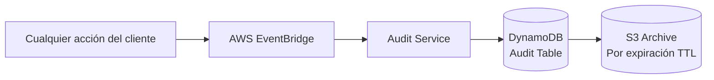

**Esquema de registro de auditoría:**

| Campo | Tipo | Descripción |
|---|---|---|
| `auditId` | String (PK) | UUID v4 único |
| `clientId` | String (SK) | ID del cliente |
| `timestamp` | ISO 8601 | Fecha y hora UTC |
| `action` | String | LOGIN, TRANSFER, QUERY, etc. |
| `sourceIP` | String | IP origen |
| `channel` | String | WEB / MOBILE |
| `payload` | JSON | Detalle de la acción (sin datos sensibles) |
| `result` | String | SUCCESS / FAILURE |

---

## 11. Infraestructura en Nube — AWS

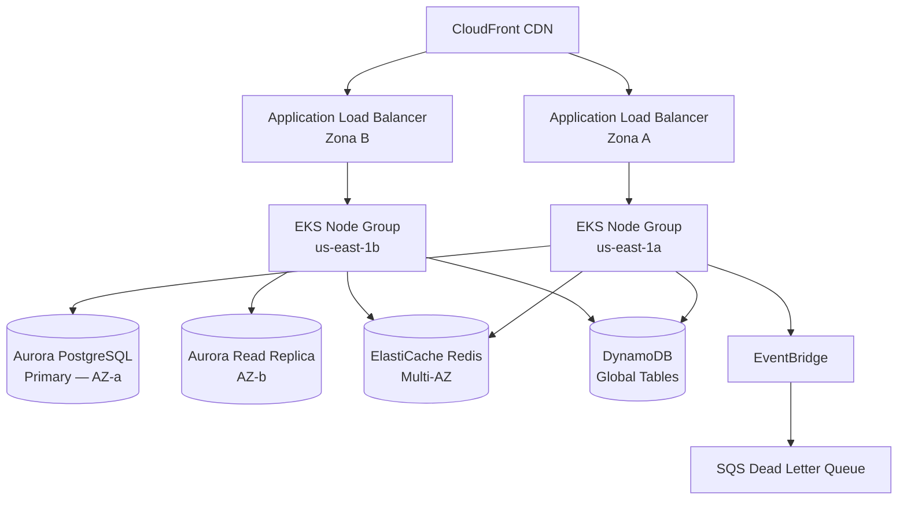

### Servicios AWS utilizados

| Servicio | Uso | Justificación |
|---|---|---|
| EKS (Kubernetes) | Orquestación de microservicios | Portabilidad, auto-healing, HPA |
| Aurora PostgreSQL | Base de datos operacional | ACID, Multi-AZ, failover automático < 30s |
| DynamoDB | Auditoría append-only | Escala ilimitada, inmutabilidad vía IAM |
| ElastiCache Redis | Cache-Aside | Sub-milisecond latency, Multi-AZ |
| API Gateway | Gateway de entrada | Rate limiting, JWT validation, WAF |
| EventBridge | Bus de eventos | Desacoplamiento, routing por reglas |
| SQS | Dead Letter Queue | Reintentos y tolerancia a fallos |
| CloudFront | CDN para SPA | Baja latencia global, caché de assets |
| Rekognition | Reconocimiento facial | ML gestionado, sin infraestructura |
| SES | Email transaccional | SLA 99.9%, cumplimiento regulatorio |
| SNS | SMS / Push | Multi-canal, entrega garantizada |
| WAF + Shield | Seguridad perimetral | Protección DDoS y OWASP Top 10 |
| CloudWatch | Monitoreo y alertas | Métricas, logs, dashboards, alarmas |
| Secrets Manager | Gestión de secretos | Rotación automática, sin hardcoding |

---

## 12. Alta Disponibilidad, Tolerancia a Fallos y Recuperación ante Desastres

### Alta Disponibilidad (HA)

- **Multi-AZ:** Todos los servicios desplegados en mínimo 2 zonas de disponibilidad
- **Auto Scaling:** HPA en Kubernetes ajusta réplicas según CPU/RPS
- **Load Balancing:** ALB distribuye tráfico entre zonas automáticamente
- **Circuit Breaker:** Resilience4j previene cascada de fallos hacia sistemas externos
- **Aurora Multi-AZ:** Failover automático en < 30 segundos sin intervención manual

### Tolerancia a Fallos

- **SQS Dead Letter Queue:** Eventos que fallan después de 3 reintentos van a DLQ para revisión
- **Idempotency Keys:** Las transferencias incluyen `idempotencyKey` para evitar duplicados en reintentos
- **Graceful Degradation:** Si el Sistema de Detalle falla, Account Service retorna datos básicos del Core
- **Timeout + Retry:** Configurados en todos los clientes HTTP con backoff exponencial

### Recuperación ante Desastres (DR)

| RTO | RPO | Estrategia |
|---|---|---|
| < 1 hora | < 5 minutos | Aurora Global Database — réplica en región secundaria |
| < 4 horas | < 1 hora | DynamoDB Global Tables replicado en us-west-2 |
| < 15 minutos | 0 (eventos) | EventBridge replay de eventos archivados |

---

## 13. Seguridad

### Capas de Seguridad

| Capa | Control | Tecnología |
|---|---|---|
| Perímetro | DDoS, OWASP Top 10 | AWS WAF + Shield Advanced |
| Transporte | Cifrado en tránsito | TLS 1.3 en todos los canales |
| Autenticación | JWT + PKCE + MFA | Keycloak + AWS Cognito (fallback) |
| Autorización | RBAC por rol y canal | Keycloak + Spring Security |
| Datos en reposo | Cifrado AES-256 | AWS KMS en Aurora, DynamoDB, S3 |
| Secretos | Sin hardcoding | AWS Secrets Manager con rotación |
| Código | SAST / DAST | SonarQube + OWASP ZAP en CI/CD |
| Contenedores | Escaneo de imágenes | Amazon ECR Image Scanning |

### Consideraciones Normativas

| Normativa | Aplicación |
|---|---|
| **PCI DSS v4** | Datos de tarjetas — cifrado, logging, segmentación de red |
| **Ley de Protección de Datos** | Consentimiento, derecho al olvido, minimización de datos |
| **SOX** | Registro de auditoría inmutable, controles de acceso financiero |
| **PSD2 / Open Banking** | Strong Customer Authentication (SCA) con 2FA obligatorio |
| **ISO 27001** | SGSI — políticas de seguridad, gestión de riesgos |
| **SWIFT Security Framework** | Controles para transferencias interbancarias |
| **Circular SFC / Superfinanciera** | Continuidad de negocio, gestión de incidentes, reporte regulatorio |
| **GDPR / ISO 29134** | Privacy by Design, evaluación de impacto (DPIA) |

---

## 14. Monitoreo y Excelencia Operativa

### Stack de Observabilidad

| Pilar | Herramienta | Qué mide |
|---|---|---|
| Métricas | CloudWatch + Prometheus | CPU, memoria, RPS, latencia p95/p99 |
| Logs | CloudWatch Logs + Elasticsearch | Trazas de request, errores, auditoría |
| Trazas | AWS X-Ray | Distributed tracing entre microservicios |
| Alertas | CloudWatch Alarms + PagerDuty | Anomalías, errores críticos, SLA breach |
| Dashboards | Grafana | Vista unificada de salud del sistema |

### KPIs de Producción

| Métrica | Objetivo |
|---|---|
| Disponibilidad | 99.95% mensual |
| Latencia p95 (consultas) | < 300ms |
| Latencia p95 (transferencias) | < 2 segundos |
| Tasa de error | < 0.1% |
| Tiempo de failover Aurora | < 30 segundos |

### Auto-Healing

- **Kubernetes Liveness/Readiness Probes:** Reinicia pods no saludables automáticamente
- **EKS Node Auto Repair:** Reemplaza nodos con fallo sin intervención manual
- **Aurora Auto Failover:** Promueve réplica a primaria en fallo de la primaria
- **Lambda Retry:** Reintentos automáticos en procesamiento de eventos

---

## 15. Decisiones Arquitectónicas (ADR)

| # | Decisión | Opción elegida | Alternativa evaluada | Justificación |
|---|---|---|---|---|
| 1 | Arquitectura base | Microservicios | Monolito | Escalabilidad independiente por servicio; despliegue sin coordinación global |
| 2 | Orquestación | EKS (Kubernetes) | ECS Fargate | Portabilidad, comunidad, HPA y self-healing nativo |
| 3 | BD Operacional | Aurora PostgreSQL | RDS MySQL | ACID, failover < 30s, réplicas de lectura, compatibilidad PostgreSQL |
| 4 | BD Auditoría | DynamoDB | PostgreSQL | Escala ilimitada, inmutabilidad vía IAM, TTL nativo |
| 5 | Caché | Redis (ElastiCache) | Memcached | Estructuras de datos avanzadas, persistencia, pub/sub para invalidación |
| 6 | Mensajería | EventBridge | Kafka | Menor operación, integración nativa AWS, routing por reglas declarativas |
| 7 | Auth flow | Authorization Code + PKCE | Implicit Flow | RFC 8252 / OAuth 2.1 — PKCE es el estándar para apps públicas |
| 8 | IdP | Keycloak | Implementación propia | Producto corporativo existente, reduce TCO, OAuth 2.0 / OIDC compliant |
| 9 | Biometría | AWS Rekognition | Azure Face API | BP ya opera en AWS — menor latencia, sin egress cross-cloud |
| 10 | App Móvil | Flutter | React Native | Un solo código para iOS/Android, acceso a APIs biométricas nativas |
| 11 | SPA | React + TypeScript | Angular | Ecosistema más amplio, flexibilidad, TypeScript para type safety |
| 12 | Patrón Caché | Cache-Aside | Write-Through | Core Banking externo no soporta write-through; control explícito de invalidación |
| 13 | Notificaciones | EventBridge + SES + SNS | Twilio | Integración nativa AWS, menor latencia, SLA 99.9%, menor costo |
| 14 | Gateway | AWS API Gateway | Kong | Menor operación, integración con WAF, Lambda authorizer nativo |

---

*Arquitectura diseñada bajo modelo C4 — Context · Container · Component*
