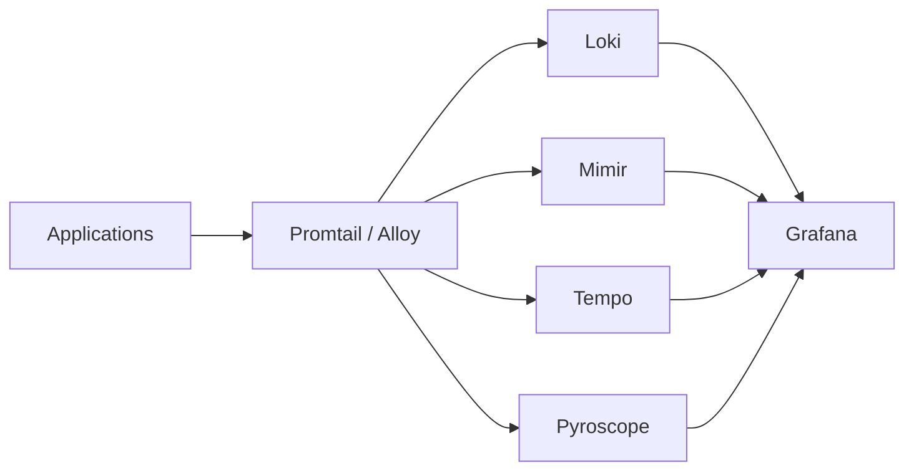
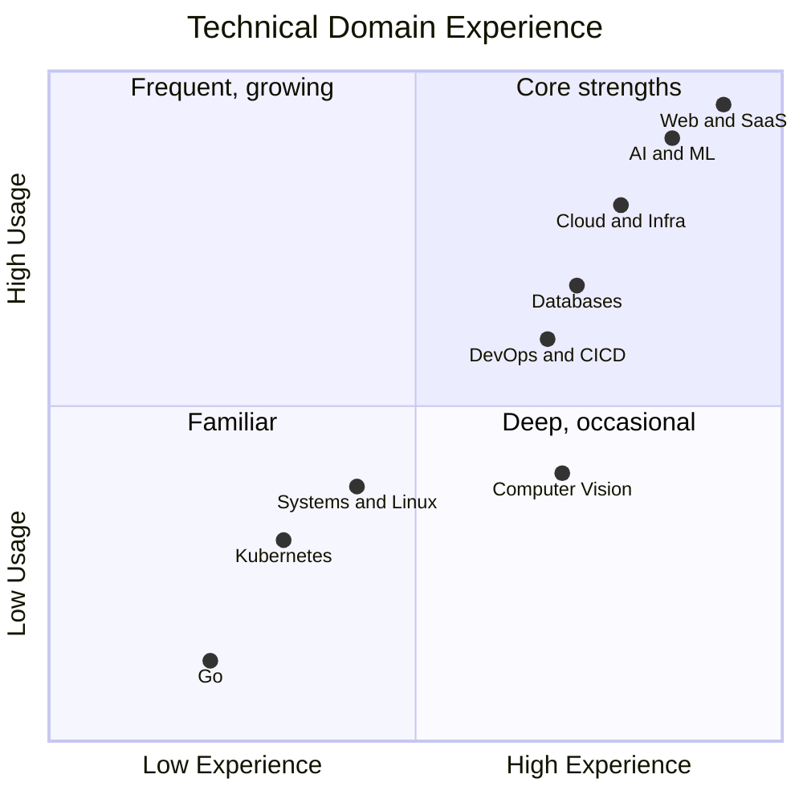

# Canonical Written Interview

---

## Education

### How did you fare in high school mathematics, physical sciences and computing? Which were strengths and which were most enjoyable? How did you rank, competitively, in them?

Mathematics and physics came naturally to me and were consistently my strongest subjects. Mathematics was my favourite from early on — it shaped how I approach technical problems to this day. Computing was equally strong and enjoyable because it let me apply logical reasoning in a practical, creative way. These three subjects were my top performers academically, and I ranked among the leading students in all of them.

---

### Which degree and university did you choose, and why?

I studied Software Engineering at Universidad de las Fuerzas Armadas ESPE in Ecuador. ESPE was among the first universities in Ecuador to offer Systems Engineering — which later evolved into Software Engineering — giving it a strong technical reputation and a serious engineering culture. I wanted a degree with real depth, not surface-level exposure to programming, and ESPE offered exactly that.

---

### What did you enjoy most about your time at university?

What I enjoyed most was turning technical ideas into working systems. I was particularly drawn to projects that combined software with AI, computer vision, or real-world interaction, because they pushed me beyond isolated assignments. University also taught me discipline: how to keep building under pressure and work consistently over time.

---

### Outside of class, what were your interests and where did you spend your time?

A large part of my time outside class went into maintaining my financial-aid scholarship. I had relocated from another city to study, and that support covered my living costs, so keeping it was both a responsibility and a strong motivation. Outside that, I spent most of my time on technical projects, self-learning, and later teaching programming.

---

### What did you achieve at university that you consider exceptional?

The achievement I am most proud of is connecting academic work with applied engineering. During that period I built a shooting range simulator with shot detection, intelligent classification, and scoring. That work also contributed to a peer-reviewed research publication on predicting correct firing positions using a MANFIS model. Having a working system and a publication reinforce each other was a meaningful milestone. It is the clearest example of the kind of engineering I want to keep doing.

---

## Context

### Do you have experience operating or designing Observability solutions?

Yes. I have practical experience with Grafana and Loki — Grafana for dashboards and operational visibility, and Loki for centralised log aggregation and analysis. I am also familiar with the broader Grafana stack: Promtail and Grafana Alloy for collection pipelines, Tempo for distributed traces, Mimir for metrics at scale, and Pyroscope for continuous profiling.

---

### Do you have experience operating or designing distributed tracing solutions?

I do not yet have deep production ownership of a dedicated distributed tracing platform. However, I have worked on distributed systems involving frontend clients, backend APIs, OCR pipelines, queues, AI providers, and cloud services — where understanding request flow, latency, and failure propagation was essential. The operational reasoning behind tracing is familiar to me; hands-on depth with a dedicated tracing stack is something I am actively building toward.

---

### Do you have experience operating or designing service mesh solutions?

My familiarity with service meshes is conceptual rather than hands-on production experience. My work has been on serverless and container-based systems on AWS Lambda and ECS rather than large Kubernetes microservice environments where tools such as Istio or Linkerd are commonly used. At a foundational level, I understand service meshes as a way to standardise service-to-service traffic management, security, and telemetry across distributed systems.

---

### Do you have experience operating or designing continuous profiling solutions?

Basic exposure, not deep production experience. Most of my performance work has been practical and application-focused — identifying bottlenecks in AI workflows, OCR pipelines, and cloud applications. My current understanding is that continuous profiling helps teams see where CPU time and memory are spent over time, making it useful for diagnosing performance issues that logs and metrics alone cannot surface.

---

### Do you have experience with low-level performance and monitoring frameworks like eBPF?

I do not yet have direct production experience with eBPF. My background has been stronger at the application, cloud, and integration layers. One reason this role is attractive to me is that it would let me go deeper into the systems side of engineering.

---

### Do you have experience operating or designing Kubernetes deployments, and with container-based operations in general?

I have solid experience with container-based operations — Docker, AWS ECS deployments, and production systems delivered via AWS Lambda and ECS, supported by CI/CD pipelines in GitHub Actions. My direct Kubernetes experience is still limited, but I am comfortable with the operational patterns around containers, environments, and repeatable releases.

---

### Have you had any involvement in open source projects?

I have not made direct upstream open source contributions yet, and I want to be honest about that. However, I have implemented open source tools in production environments:

- **AnythingLLM** at Fenix Corp — open source AI application for RAG, document-based chat, and private knowledge workflows
- **Attendee** at Pinecrest — open source meeting bot API for Zoom and Google Meet

Contributing directly to upstream projects is something I want to start doing soon.

---

### Outline your thoughts on the challenges of building and operating a dependable Observability stack.

A dependable observability stack has to be useful, affordable, and trustworthy at the same time.

- **Signal quality:** Logs, metrics, traces, and profiles can become noisy or expensive very quickly if instrumentation standards are weak or inconsistent.
- **Platform reliability:** The observability system itself must stay reliable during incidents — that is precisely when engineers need it most.
- **Actionability:** Good observability should help teams understand system behaviour under normal load, failure, and change without overwhelming them with data that has no clear action.

The discipline is as much cultural as technical: getting teams to instrument well and to act on what they observe.

---

### Why do you most want to work for Canonical?

Canonical operates close to the foundation layers of modern software: Linux, infrastructure, open source, and systems engineering. My background is strong in application development, AI systems, cloud automation, and production delivery, and I see this role as an opportunity to go deeper into platform engineering and observability. I also value Canonical's engineering standards and open source culture — the idea that the work you ship is something the community can inspect, use, and build on.

---

## Engineering Experience

### What kinds of software projects have you worked on before?

Operating systems and environments: Linux-oriented developer setups and cloud deployments using Docker, GitHub Actions, AWS Lambda, ECS, and SST.

---

### Give details of your Python software development experience. How would you rate your competency?

Python has been one of my strongest languages. I have used it extensively in AI-related work, scripting, computer vision, experimentation, and teaching — including the research published as part of the shooting range simulator project.

**Self-assessment:** Strong intermediate to advanced for practical engineering work.

---

### Give details of your Go software development experience. How would you rate your competency?

I learned Go at university and appreciated its simplicity and clarity. However, I have not yet had the opportunity to use it in a significant production project. My strongest backend experience has been in Node.js / NestJS, Python, and some Java-based systems.

**Self-assessment:** Beginner to early intermediate.

---

### Which project or piece of software are you most proud of, and why?

The shooting range simulator with shot detection, intelligent classification, and scoring — and the associated research publication. It stands out because it combined software engineering, AI, computer vision, and practical real-world impact in a single coherent system. It reflects the kind of engineering work I enjoy most.

---

### Give details of any experience with automated provisioning, configuration management, and infrastructure-as-code tools.

Practical experience with deployment automation and reproducible cloud delivery through GitHub Actions, custom CI/CD scripts, SST, and AWS workflows. I have deployed production systems on AWS Lambda and ECS and worked extensively with Docker-based environments. My experience is stronger in practical cloud automation than in heavyweight configuration management platforms such as Ansible or Puppet.

---

### How comprehensive is your knowledge of Linux, from the kernel up?

My Linux knowledge is practical and developer-oriented rather than deeply kernel-specialist. I am comfortable with the command line, debugging applications in Linux-based environments, handling containers, running scripts, and understanding how runtimes and processes behave in cloud systems. I would not yet claim deep expertise in kernel internals or packaging — and that is one reason this role is attractive to me.

---

### How do you like to set up your Linux desktop environment?

I prefer a setup that is simple, fast, and focused: a clean desktop, a strong terminal workflow, keyboard-friendly tools, and as little unnecessary overhead as possible. My goal is an environment that supports concentration rather than customisation for its own sake.

---

### Describe your experience with public cloud operations.

Hands-on experience centred on AWS: Lambda, ECS, S3, CloudFront, API integration patterns, and SST-based workflows. That has given me a practical understanding of environment separation, CI/CD, operational trade-offs, and developer experience in cloud systems. I have not yet managed a very large cloud estate, but I understand the discipline required to build systems that are maintainable and reliable at scale.

---

### Outline your thoughts on quality in software development.

Software quality starts with clarity. If requirements, interfaces, and responsibilities are unclear, quality problems appear early and compound. The practices I value most:

- Small, reviewable changes
- Automated checks where they genuinely matter
- Reproducible deployments
- Solid debugging and observability
- Feedback loops from production back into engineering decisions

Good communication and maintainability are also part of quality — not optional extras.

---

### Outline your thoughts on documentation in software projects.

Documentation should reduce repeated questions and make systems easier to understand over time. Teams should document architecture, setup, runbooks, key decisions, and operational flows close to the code.

Tools and practices I value:
- **Obsidian** for building connected documentation graphs and knowledge bases
- **Mermaid diagrams** because a diagram often explains system relationships faster than plain text — and they live in the same repository as the code
- **Graph-based code indexing** to reduce repetitive lookups across large codebases

For great open source documentation examples: the Grafana project docs, the NestJS docs, and the Rust Book are all examples of documentation that respects the reader's time.
